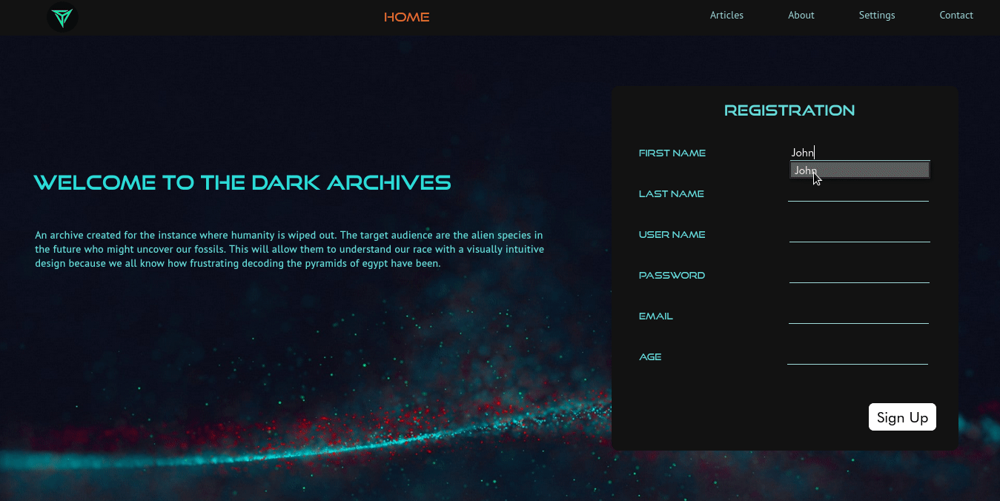

# Dark Archives

This cheesily named project is my first take on incorporating a frontend and backend. 

## Description
This project contains a simple website displaying information and includes a registration system. It presents some information about ancient egypt for just show casing the formatting. The frontend is made using HTML, CSS and the backend is made using php. The backend is connected to an sql database which is used to store and access data. Here we see the main page of the site and a subpage.

Here is a demo of the registration system. It takes the input and stores it in the sql database and in the settings page, any of the given information can be changed using the email. 

## What I learned

- Integrating backend with frontend 
- Relationships between the design and processing elements
- Creating intuitive design and choosing appropriate color schemes
- Limitations of choosing the wrong framework for backend processing